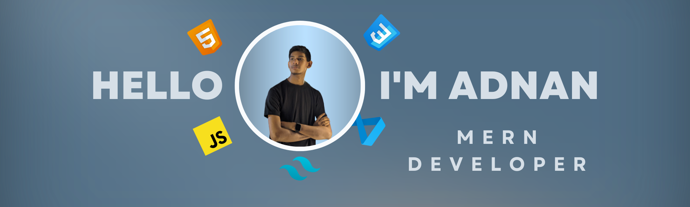

  

###

<h1 align="left">Hi there 👋</h1>

###

I’m Adnan Bin Akhlas, a MERN Stack developer based in Dhaka, Bangladesh. I’m passionate about building user-friendly web applications and always eager to learn new technologies.

###

<h2 align="left">About Me</h2>

###

🛠️ I’m currently working on enhancing my MERN stack skills 🌱 I’m currently learning advanced JavaScript and React.js 💬 Ask me about front-end development, MERN stack, or anything tech-related 🎯 Fun Fact: I love to try different mechanical keyboards 📚 In my free time, I enjoy learning about psychology

###

<h2 align="left">What I Work With</h2>

###

  
  
  
  
  
  
  
  
  
  
  
  
  
  
  

###

<h2 align="left">Connect With Me</h2>

###

  
  
  

###

<h2 align="left">My GitHub Stats</h2>

###

  
  

###

<h2 align="left">🤝 Let's Collaborate!</h2>

###

I'm open to collaborating on exciting projects, building amazing applications, and contributing to open-source initiatives.

###

<h4 align="left">⭐ Don't forget to star my repositories if you find them useful!</h4>

###

